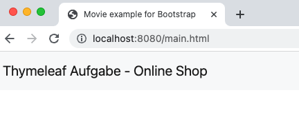
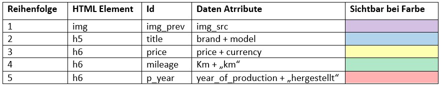

**Aufgabe 1**

Stellen Sie die Autos mit ihren Informationen dar. Nutzen Sie hierfür
das Fragment „grid.html" und erweitern Sie es so, dass bei Aufruf der
index.html ein gleiches Ergebnis, wie im Anhang, zeigt.

a)  Nutzen Sie für die Umsetzung bitte die Card aus Bootstrap 5.0
    ([hier](https://getbootstrap.com/docs/5.0/components/card/)). Wie in
    der Abbildung 1.1 zu erkennen, sollten bei dem mittleren Breackpoint
    nur genau drei Cards nebeneinander sein. **Verwenden Sie unbedingt
    die in Abbildung 1.2 spezifizierten Attribute und Ids**.

b)  Fügen Sie allen **h6** Elementen der Card die Klasse „text-muted"
    hinzu. Ergänzen Sie an geeigneter Stelle mit Hilfe einer **Bootstrap
    Klassen Annotation** einen **margin bottom 4**, sodass alle Cards
    einen vertikalen Abstand voneinander besitzen.

**Aufgabe 2**

a)  Erstellen Sie im **Controller die nötigen Methoden**, sodass bei
    Aufruf von „localhost:8080/main" die „main.html" angezeigt wird.
    Verwenden Sie herfür **nicht** das ModelAndView Objekt,
    sondern eine andere Variante.

b)  Erweitern Sie die „main.html" Datei, indem sie das Fragment
    **„navbar" einbinden**. Als html tag verwenden Sie hier bitte
    **\<section\>\</section\>** mit der **Id = navbar.**

**Anhang**

Abb. 1.1

Abb. 1.2

 
